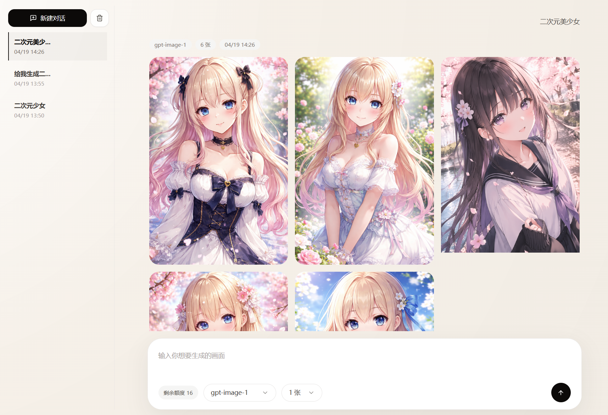
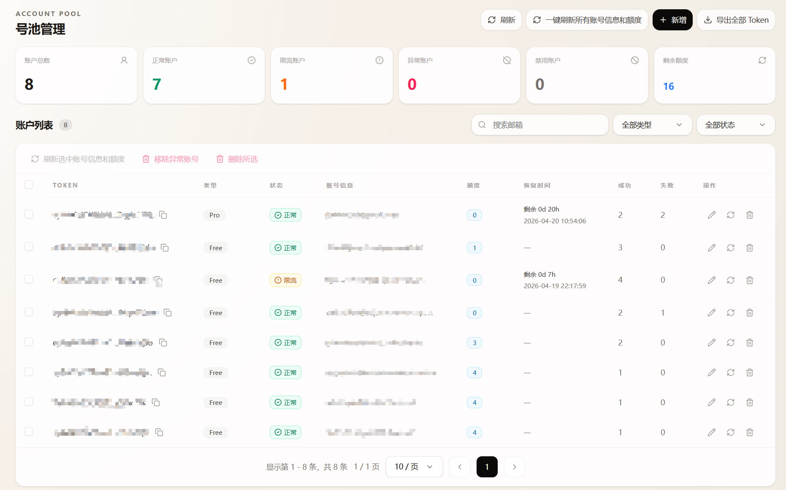

# chatgpt2api

本项目仅供学习与研究交流。请务必遵循 OpenAI 的使用条款及当地法律法规，不得用于非法用途！

ChatGPT 图片生成代理与账号池管理面板，提供账号维护、额度刷新和图片生成接口。

## 功能

- 批量导入和管理 `access_token`
- 自动刷新账号邮箱、类型、图片额度、恢复时间
- 轮询可用账号进行图片生成
- 失效 Token 自动剔除
- 提供 Web 后台管理账号和生成图片 

> 目前仅实现了生图效果，编辑图片以及gpt-image-2模型尚未实现，需要后续更新。

生图界面：


号池管理：


## 接口

所有接口都需要请求头：

```http
Authorization: Bearer <auth-key>
```

### 图片生成

```http
POST /v1/images/generations
```

请求体示例：

```json
{
  "prompt": "a cyberpunk cat walking in rainy Tokyo street",
  "model": "gpt-image-1",
  "n": 1,
  "response_format": "b64_json"
}
```

## 部署

```bash
git clone git@github.com:basketikun/chatgpt2api.git
cp config.example.json config.json
# 编辑 config.json密钥
docker compose up -d
```

## 社区支持
学 AI , 上 L 站

[LinuxDO](https://linux.do)